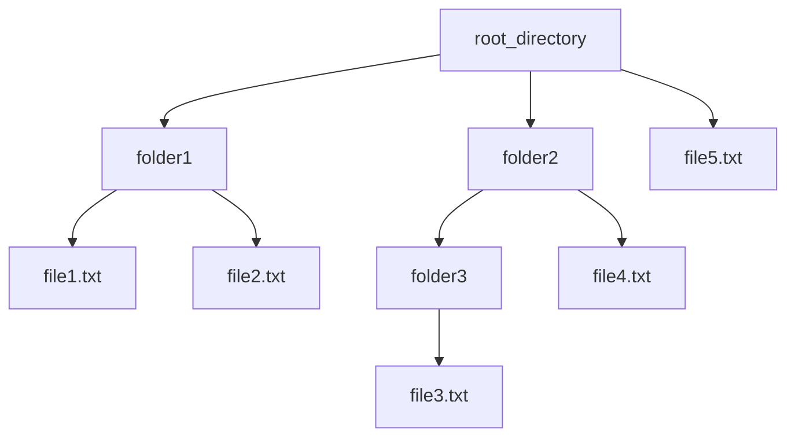

# AI Programming with Python Project

Project code for Udacity's AI Programming with Python Nanodegree program. In this project, students first develop code for an image classifier built with PyTorch, then convert it into a command line application.

## Project Structure and files
The project has been forked from [udacity/aipnd-project](https://github.com/udacity/aipnd-project). All folders and files that have been modified are listed below with a short description:


```
root_directory/  
|     
+-- folder1/  
|   |  
|   +-- file1.txt  
|   +-- file2.txt  
|  
+-- folder2/  
|   |  
|   +-- folder3/  
|   |   |  
|   |   +-- file3.txt  
|

 
```




## System Setup

The solution has been developed locally with *Anaconda* based on a fork of the [Starter Code](https://github.com/udacity/aipnd-project).

Overview of the used language version, tools and libraries.

| Module           | Version |
| ---------------- | ------- |
| python           | 3.11.7  |
| conda            | 2.1.4   |
| jupyter notebook | 7.0.6   |
| matplotlib       | 3.8.0   |
| seaborn          | 0.12.2  |
| numpy            | 1.26.3  |
| pandas           | 2.1.4   |
| pillow           | 10.0.1  |
| pytorch          | 2.2.0   |
| torchvision      | 0.17.0  |

For compatibility reasons please make sure to have an environment with all components with the respective versions in place.

## Training, Test and Validation Data

Everything what you need to run the solution is in the project except the image data. This is due to the large amount of about 329MB (8189 images).

Steps to download and install the images
1. Download [Flower Data](https://s3.amazonaws.com/content.udacity-data.com/nd089/flower_data.tar.gz)
2. Create a folder ```flowers``` on the project root.
3. Unzip the files into the previously created directory

## Training and Prediction from the Command Line

### Training Neural Network


```bash
DATA_DIR='./flowers'

python train.py $DATA_DIR 
python train.py $DATA_DIR --arch VGG16 --epochs 5 --gpu
```

```bash
CHECKPOINT_FILE='./checkpoint.pth'
IMAGE_PATH='./flowers/test/10/image_07090.jpg'
CAT_NAMES='./cat_to_name.json'

python predict.py $IMAGE_PATH $CHECKPOINT_FILE --top_k 3
```

## Comparison of the different CNN types

| Architecture | Duration | Accuracy |
| ------------ | -------: | -------: |
| AlexNet      |     659s |    86.6% |
| DenseNet121  |     810s |    89.6% |
| VGG16        |    1099s |    90.1% |

